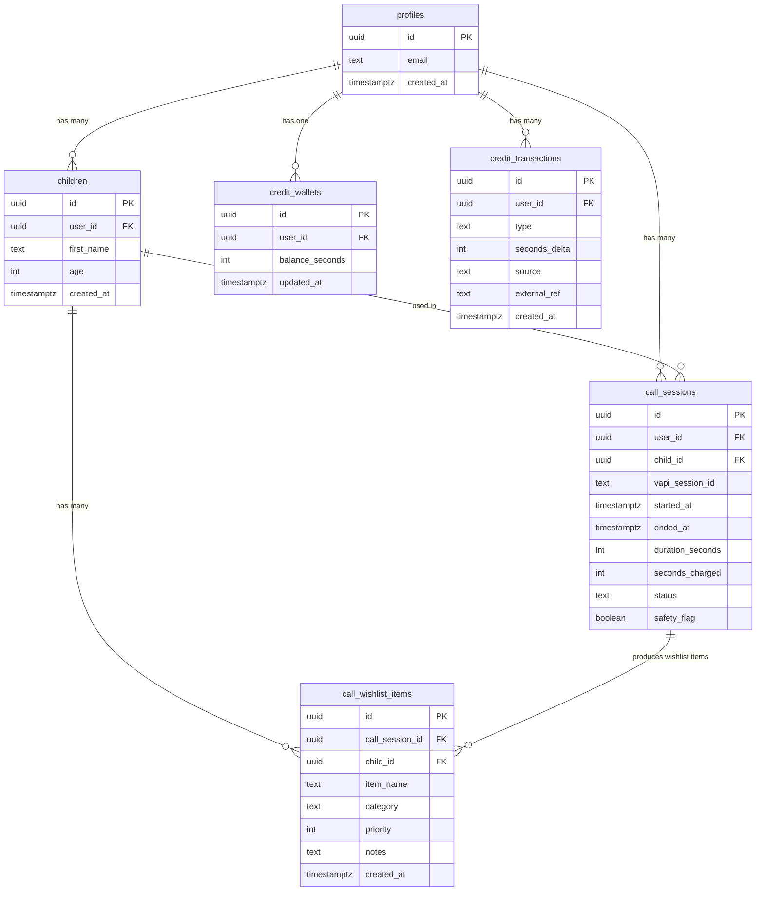
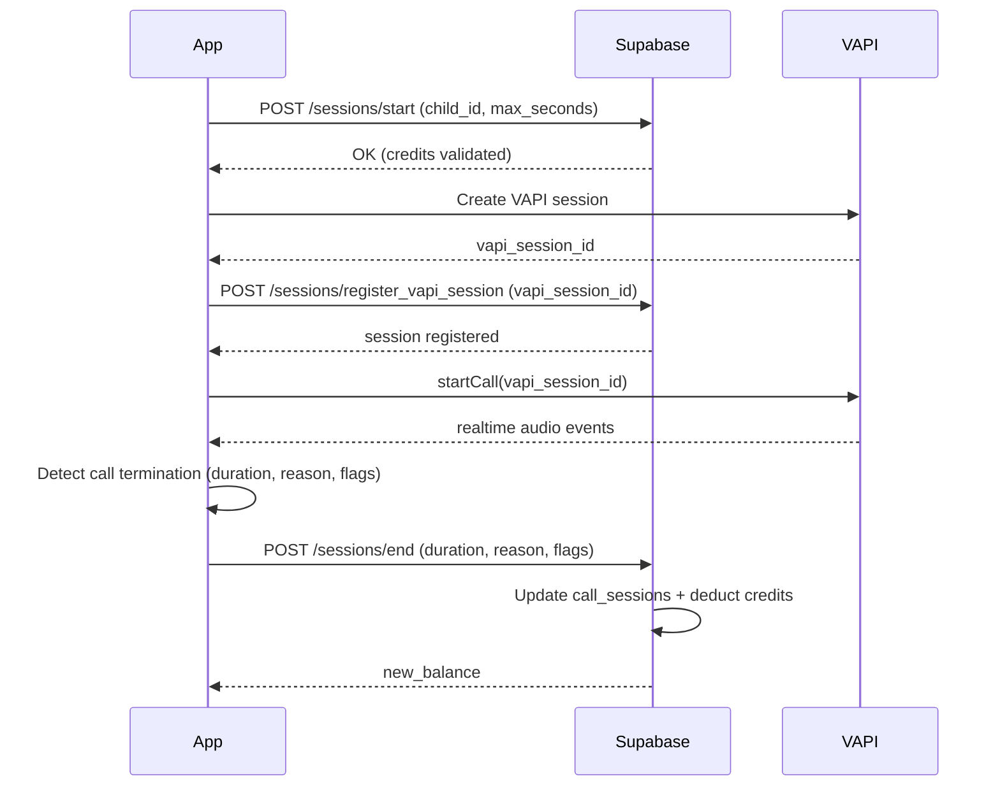
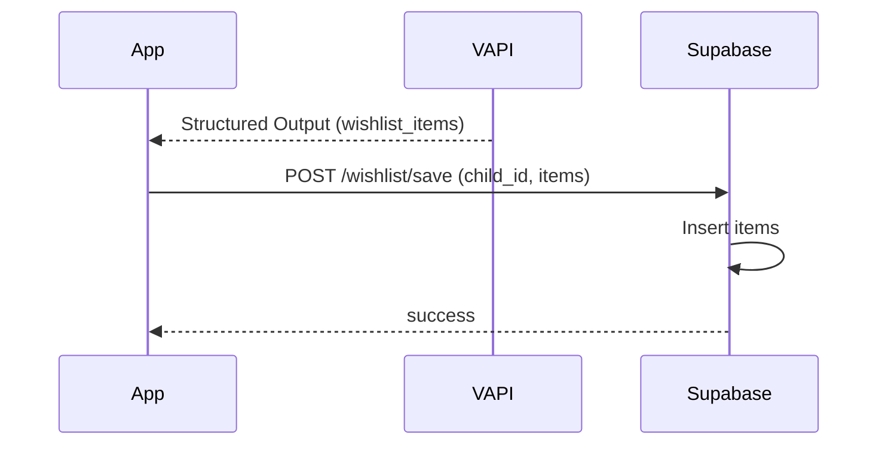

# 📲 SantaCall — Integración Completa con Supabase

1. Autenticación de padres (Google / Apple).
2. Gestión de créditos (token wallet).
3. Registro de sesiones de llamadas (VAPI).
4. Wishlist automática del niño a través del agente.
5. Integración con la app móvil (iOS / Android).
6. Edge Functions (todas llamadas desde la app).
7. Soporte para **múltiples niños por cuenta**.

> Toda la sincronización la hace la app móvil.

---

# 1. Arquitectura General

### App Móvil (iOS / Android)

- Login nativo con Google / Apple.
- Manejo del audio en tiempo real con **VAPI SDK**.
- La app inicia y finaliza sesiones de VAPI.
- Guarda datos locales del niño (UI), pero la referencia principal es child_id en Supabase.
- Llama Edge Functions para:
    - Confirmar compras (IAP)
    - Iniciar llamadas
    - Finalizar llamadas
    - Guardar wishlist por niño

### Supabase

- **Auth** → Google / Apple.
- **Postgres** → perfiles, niños, créditos, sesiones, wishlist.
- **Edge Functions** → backend serverless.
- **RLS** → seguridad por fila para cada padre.

---

# 2. Modelo de Datos en Supabase

A continuación se presenta el esquema final del modelo de datos, incluyendo soporte multi-niño.

---

## 2.1 profiles (padres)

```sql
create table profiles (
  id uuid primary key references auth.users(id) on delete cascade,
  email text not null,
  created_at timestamptz default now()
);

-- Trigger to create profile on signup
create or replace function public.handle_new_user()
returns trigger as $$
begin
  insert into public.profiles (id, email)
  values (new.id, new.email);
  return new;
end;
$$ language plpgsql security definer;

create trigger on_auth_user_created
  after insert on auth.users
  for each row execute procedure public.handle_new_user();
```

---

## 2.2 children (múltiples niños por padre)

```sql
create table children (
  id uuid primary key default uuid_generate_v4(),
  user_id uuid references profiles(id) on delete cascade,
  first_name text not null,
  age integer,
  created_at timestamptz default now()
);
```

---

## 2.3 credit_wallets

```sql
create table credit_wallets (
  id uuid primary key default uuid_generate_v4(),
  user_id uuid references profiles(id) on delete cascade,
  balance_seconds integer default 0,
  updated_at timestamptz default now()
);
```

---

## 2.4 credit_transactions

```sql
create table credit_transactions (
  id uuid primary key default uuid_generate_v4(),
  user_id uuid references profiles(id) on delete cascade,
  type text not null,
  seconds_delta integer not null,
  source text not null,
  external_ref text,
  created_at timestamptz default now()
);
```

---

## 2.5 call_sessions (actualizado para multi-niño)

```sql
create table call_sessions (
  id uuid primary key default uuid_generate_v4(),
  user_id uuid references profiles(id) on delete cascade,
  child_id uuid references children(id) on delete cascade,
  vapi_session_id text not null,
  started_at timestamptz default now(),
  ended_at timestamptz,
  duration_seconds integer,
  seconds_charged integer,
  status text,
  safety_flag boolean default false,
  created_at timestamptz default now()
);
```

---

## 2.6 call_wishlist_items

```sql
create table call_wishlist_items (
  id uuid primary key default uuid_generate_v4(),
  call_session_id uuid references call_sessions(id) on delete cascade,
  child_id uuid references children(id) on delete cascade,
  item_name text not null,
  category text,
  priority integer,
  notes text,
  created_at timestamptz default now()
);
```

---

# 3. Edge Functions

Todas las Edge Functions se consumen 100% desde la app móvil, usando:

```
Authorization: Bearer <supabase_access_token>
```

---

## 3.1 /iap/verify — Verificar compra IAP

### Flujo:

1. App completa compra IAP.
2. Recibe recibo de App Store / Play Store.
3. Envía recibo a esta función.
4. Supabase verifica el recibo.
5. Acredita saldo.
6. Devuelve saldo actualizado.

### Body:

```json
{
  "store": "appstore",
  "receipt": "<raw_receipt>",
  "product_id": "santa_10min"
}
```

### Respuesta:

```json
{
  "success": true,
  "new_balance_seconds": 900
}
```

---

## 3.2 /sessions/start — Iniciar sesión de llamada

### Flujo:

1. Padre selecciona niño.
2. App envía child_id y max_seconds_allowed.
3. Supabase valida créditos.
4. Crea registro en call_sessions.
5. Crea sesión en VAPI vía API (desde la Edge Function).
6. Devuelve vapi_session_id.

### Body:

```json
{
  "child_id": "uuid",
  "max_seconds_allowed": 600
}
```

### Respuesta:

```json
{
  "success": true,
  "vapi_session_id": "abc123",
  "max_seconds_allowed": 600
}
```

---

## 3.3 /sessions/end — Finalizar sesión

### Flujo:

1. Cuando la llamada termina, VAPI SDK retorna:
    - duración
    - motivo
    - flags
2. La app envía estos datos al backend.

### Body:

```json
{
  "vapi_session_id": "abc123",
  "duration_seconds": 230,
  "end_reason": "normal",
  "moderation_flag": false
}
```

### Respuesta:

```json
{
  "success": true,
  "new_balance_seconds": 670
}
```

---

## 3.4 /wishlist/save — Guardar wishlist

### Guardar uno:

```json
{
  "vapi_session_id": "abc123",
  "child_id": "uuid",
  "item_name": "Red bike",
  "priority": 1
}
```

### Guardar batch:

```json
{
  "vapi_session_id": "abc123",
  "child_id": "uuid",
  "items": [
    { "item_name": "Red bike", "category": "toy", "priority": 1 },
    { "item_name": "Lego Set", "category": "toy", "priority": 2 }
  ]
}
```

---

## 3.5 /sessions/list — Historial (opcional)

Devuelve llamadas con wishlist por niño.

---

# 4. Seguridad (RLS)

Todas las tablas usan el mismo patrón:

```json
user_id = auth.uid()
```

Ejemplo:

```json
create policy "Parents read own sessions"
on call_sessions
for select using (user_id = auth.uid());
```

---

# 5. Integración con la App (iOS / Android)

---

## 5.1 Autenticación

### iOS — Apple / Google

```swift
try await supabase.auth.signInWithIdToken(
    credentials: IdTokenCredentials(
        provider: .apple,
        idToken: idTokenString
    )
)
```

### Android — Google Sign-In

```kotlin
supabase.auth.signInWithIdToken(
    provider = Google,
    idToken = idToken
)
```

---

## 5.2 Consumir Edge Functions

### Swift

```swift
let response = try await supabase.functions
  .invoke("sessions/start", body: ["child_id": childId, "max_seconds_allowed": 600])
```

### Kotlin

```kotlin
supabase.functions.invoke(
    "sessions/start", mapOf("child_id" to childId, "max_seconds_allowed" to 600)
)
```

---

## 5.3 Integrar VAPI

### Flujo:

1. App → /sessions/start
2. Recibe vapi_session_id
3. Inicializa llamada:

```
vapi.startCall(sessionId: vapiSessionId) { event in
   if event.isEnded { finishCall() }
}
```

1. App obtiene:
    - duración
    - end_reason
    - moderation_flag
2. App → /sessions/end
3. Saldo se descuenta.

---

## 5.4 Guardar wishlist

Cuando VAPI devuelve structured outputs:

```json
{
  "wishlist_items": [
    { "item_name": "Bike", "priority": 1 }
  ]
}
```

La app guarda:

```kotlin
supabase.functions.invoke("wishlist/save", body: [
  "vapi_session_id": vapiSessionId,
  "child_id": childId,
  "items": items
])
```

---

# 6. Flujos del Sistema

### ➡️ Login

App → Google/Apple → Supabase Auth → profiles

### ➡️ Comprar créditos

App → IAP → /iap/verify → wallet actualizado

### ➡️ Seleccionar niño

Padre elige niño antes de llamar → obtiene child_id

### ➡️ Iniciar llamada

App → /sessions/start → VAPI session

### ➡️ Llamada real-time

VAPI SDK maneja audio

### ➡️ Finalizar llamada

App → /sessions/end

### ➡️ Guardar wishlist

VAPI → App → /wishlist/save

---

# 7. Glosario

| Término | Definición |
| --- | --- |
| Supabase | Backend serverless (Auth + DB + Edge Functions) |
| Edge Function | Endpoint HTTP en Deno (serverless) |
| Wallet | Créditos en **segundos** para llamadas |
| VAPI SDK | Sistema de audio en tiempo real de Santa |
| Structured Outputs | JSON con wishlist |
| Niño / child | Perfil asociado al padre |

---

# 8. Diagramas Mermaid

---

## 8.1 ERD — Modelo de Datos



---

## 8.2 Secuencia — Inicio y Fin de Llamada



---

## 8.3 Wishlist Flow



---
